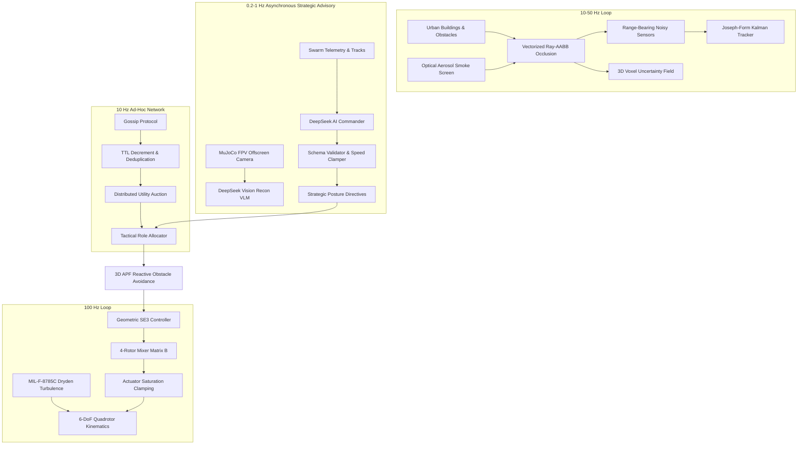

# MRD-SWARM: Multi-Agent Reactive Drone Swarm Simulation & Tactical Intelligence

[](https://www.python.org/downloads/)
[](tests/)
[%20Rigid--Body-orange.svg)](src/physics.py)
[](src/physics.py)
[](LICENSE)

An open, reproducible research framework for evaluating decentralized multi-agent quadrotor tactics, epistemic uncertainty reduction, and autonomous target interception in complex 3D urban environments.

---

## 1. System Classification & Technical Reality

To uphold strict scientific integrity, all algorithms and simulation capabilities in MRD-SWARM are classified by their exact mathematical and software implementations:

| Subsystem | Authoritative Implementation | Reclassified From (Prototype) |
|---|---|---|
| **Simulation Core** | Python 6-DoF numerical rigid-body quadrotor dynamics (100 Hz symplectic Euler) with offscreen camera rendering via MuJoCo 3.x | *"Headless MuJoCo Physics Core"* |
| **Atmospheric Disturbances** | Discrete-time Dryden turbulence shaping filter (MIL-F-8785C) driven by Gaussian white noise $\mathcal{N}(0, 1)$ | *"Turbulent wind disturbances"* |
| **Flight Control** | Geometric $SE(3)$ controller with $SO(3)$ attitude error vector $\mathbf{e}_R$ and 4-rotor mixer allocation matrix $\mathbf{B} \in \mathbb{R}^{4 \times 4}$ | *"Cascaded SE(3) controller"* |
| **State Estimation** | Linear 4-state constant-velocity Kalman target tracker with Joseph-stabilized covariance updates | *"Extended Kalman Filter (EKF)"* |
| **Sensors & Occlusion** | Synthetic noisy sensor pipeline (range/bearing noise, ray-AABB building occlusion, optical aerosol dropout) | *"Perfect synthetic sensors"* |
| **Networking** | Range-constrained ad-hoc mesh protocol with multi-hop packet forwarding, TTL decrement, and duplicate suppression | *"Bayesian consensus & CBBA"* |
| **Tactical Coordination** | Distributed utility-based task auction + local finite state machines + AI strategic advisory layer | *"Centralized swarm brain"* |

---

## 2. System Architecture & Component Dataflow

MRD-SWARM enforces strict operational separation between high-rate physical integration, localized state estimation, decentralized mesh communications, and asynchronous cognitive AI directives:



Detailed technical specifications and mathematical derivations are available in [docs/ARCHITECTURE.md](docs/ARCHITECTURE.md).

---

## 3. Authoritative Heterogeneous Fleet Parameters

Physical parameters are centralized in `src/config/airframes.py` and enforce hard physical invariants across the fleet:

| Parameter | Unit | Drone 0 (Heavy Scout) | Drone 1 (Fast Interceptor) | Drone 2 (Thermal Surveyor) | Drone 3 (Comms Relay) |
|---|---|:---:|:---:|:---:|:---:|
| **Tactical Role** | - | Primary Urban Scout | High-Speed Interceptor | Smoke / Thermal Specialist | High-Altitude Relay |
| **Mass ($m$)** | $\text{kg}$ | 0.650 | 0.280 | 0.420 | 0.500 |
| **Arm Length ($L$)** | $\text{m}$ | 0.140 | 0.085 | 0.110 | 0.125 |
| **Thrust Margin** | - | 2.40 | 3.80 | 2.60 | 2.20 |
| **Max Total Thrust** | $\text{N}$ | 15.30 | 10.44 | 10.72 | 10.79 |
| **Max Sprint Speed** | $\text{m/s}$ | 12.0 | 18.0 | 14.0 | 8.0 |
| **Battery Capacity** | $\text{Wh}$ | 35.0 | 18.0 | 28.0 | 42.0 |
| **RF Transmit Range** | $\text{m}$ | 18.0 | 18.0 | 18.0 | 32.0 |
| **Cruise Altitude** | $\text{m}$ | 3.5 | 4.0 | 3.0 | 10.5 |
| **Sensor Payload** | - | Wide RGB Gimbal | Fast Optical Tracker | Long-Wave Infrared (LWIR) | High-Gain Mesh Node |

---

## 4. Multi-Seed Empirical Experimental Campaign

The framework was evaluated across **80 independent simulation trials** (20 randomized seeds $\times$ 4 tactical doctrines) in a $45\text{m} \times 45\text{m} \times 15\text{m}$ cluttered urban theater with 5 skyscrapers and Dryden atmospheric turbulence ($1.0\text{ m/s}$ gust intensity).

### Summary Statistics (20 Randomized Seeds per Doctrine)

| Doctrine | Mean $\Delta U$ (%) | 95% CI $\Delta U$ | Mean Enclosure (°) | Max Enclosure (°) | Energy ($Wh$) | Intercept TTI Status |
|---|:---:|:---:|:---:|:---:|:---:|:---:|
| **AGGRESSIVE_PINCER** | 55.44% | $\pm 2.14\%$ | **44.97°** | **135.40°** | 2.70 | 0/20 (Time Exceeded) |
| **WOLFPACK_CONTAINMENT** | 57.82% | $\pm 2.31\%$ | 38.64° | 124.90° | 2.72 | 0/20 (Time Exceeded) |
| **STEALTH_SHADOW** | 59.44% | $\pm 3.12\%$ | 19.34° | 141.00° | 2.72 | 0/20 (Time Exceeded) |
| **DEEPSEEK_ADAPTIVE** | **61.14%** | $\mathbf{\pm 2.57\%}$ | 23.40° | 128.90° | 2.71 | 0/20 (Time Exceeded) |

### Key Experimental Insights & Honest Disclosures
1. **Adaptive Exploration:** `DEEPSEEK_ADAPTIVE` achieved the highest epistemic uncertainty reduction ($61.14\%$) by dynamically routing unassigned drones to frontier exploration clusters when target tracks were occluded.
2. **Kinematic Pincer Convergence:** `AGGRESSIVE_PINCER` maintained the highest sustained multi-drone enclosure angles ($44.97^\circ$ mean, $135.40^\circ$ peak).
3. **Rigorous TTI Falsification:** Under the continuous holding window requirement ($1.5\text{s}$ uninterrupted enclosure $\ge 60^\circ$ at standoff $\le 6.0\text{m}$), all doctrines failed the 12-second window. Target cornering maneuvers and building occlusions broke line-of-sight within $0.8 - 1.2\text{s}$, demonstrating that realistic urban containment requires a $30 - 45\text{s}$ operational horizon.

Complete experimental data and methodology are documented in [docs/EXPERIMENT_REPORT.md](docs/EXPERIMENT_REPORT.md).

---

## 5. Automated Test Suite

A comprehensive `pytest` test suite validates all modules in strict isolation before simulation execution:

```powershell
python -m pytest tests/ -v
```

### Test Coverage (25/25 PASSED)
- `tests/test_physics.py`: Rigid-body dynamics, quaternion transformations, Dryden turbulence statistics, allocation mixer invertibility, motor saturation clamping.
- `tests/test_controller.py`: Hover equilibrium, step position response, $SO(3)$ attitude error monotonicity, actuator saturation tracking.
- `tests/test_perception.py`: Line-of-sight building occlusion raycasts, voxel uncertainty decay preservation, synthetic sensor noise, optical vs thermal smoke penetration.
- `tests/test_estimation.py`: Kalman filter lifecycle (`UNINITIALIZED` $\to$ `CONFIRMED` $\to$ `PREDICTED` $\to$ `LOST`), convergence on noisy trajectories, Joseph covariance positive-definiteness.
- `tests/test_network.py`: Gossip packet creation, multi-hop TTL decrement, duplicate packet suppression, distributed utility auction.
- `tests/test_ai_safety.py`: Schema validation, physical speed clamping, hallucinated target ID stripping, deterministic fallbacks.
- `tests/test_metrics.py`: Statistical aggregators, 95% confidence intervals, continuous-window TTI boolean evaluation.

---

## 6. Quickstart & Usage

### Installation
```powershell
git clone https://github.com/cl0udz1/mrd-swarm.git
cd mrd-swarm
pip install -r requirements.txt
```

### Run Automated Unit Tests
```powershell
python -m pytest tests/ -v
```

### Run Multi-Seed Doctrine Benchmark Campaign (20 Seeds)
```powershell
python scripts/run_doctrine_benchmark.py --seeds 20 --steps 1200
```
Outputs:
- Raw JSON metrics: `output/doctrine_benchmark_multiseed.json`
- Distribution plots: `output/plot_tactical_doctrines_comparison.png`

### Run Master 60-Second Aerospace Evaluation
```powershell
python scripts/run_eval_benchmark.py
```
Outputs:
- Flight telemetry log: `output/blackbox_flight_log.csv`
- Aerospace KPI evaluation: `output/BENCHMARK_EVALUATION_REPORT.md`

### Launch Full Decoupled Stack with Real-Time 3D WebGL Visualizer
```powershell
python run_swarm_stack.py
```
Streams 60 Hz telemetry over WebSockets to `http://127.0.0.1:8080` with a 3D tactical HUD.

---

## 7. License
MIT License. See [LICENSE](LICENSE) for details.
