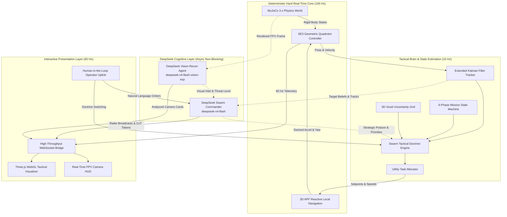
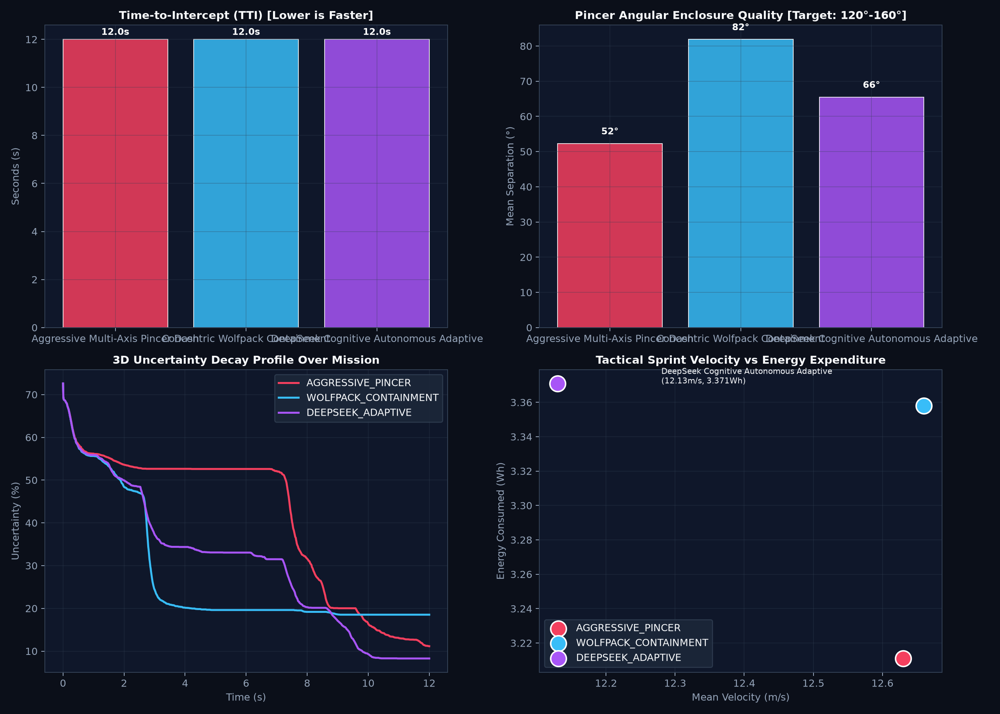
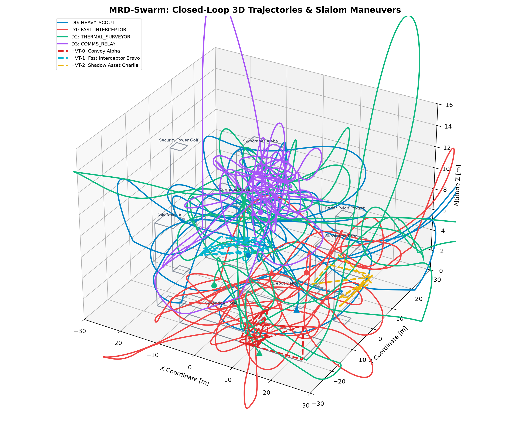
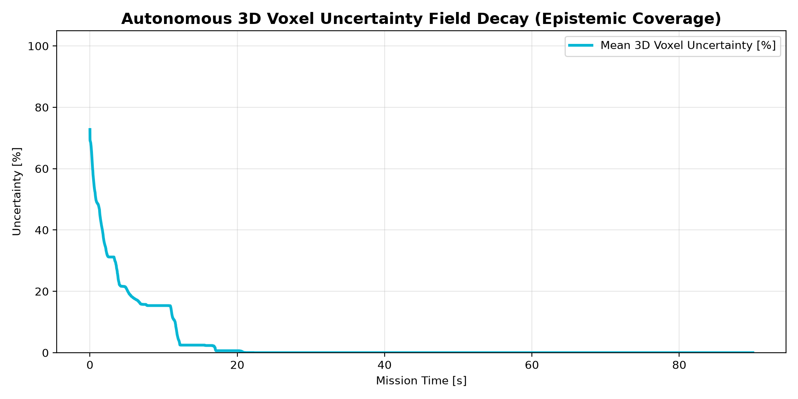
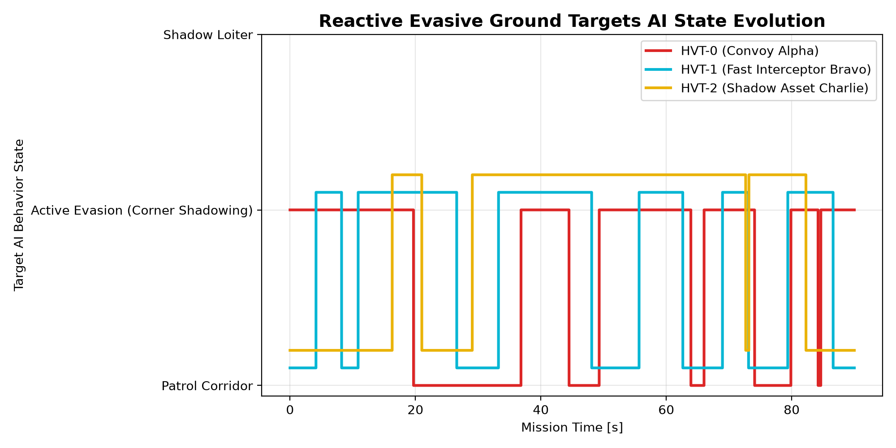
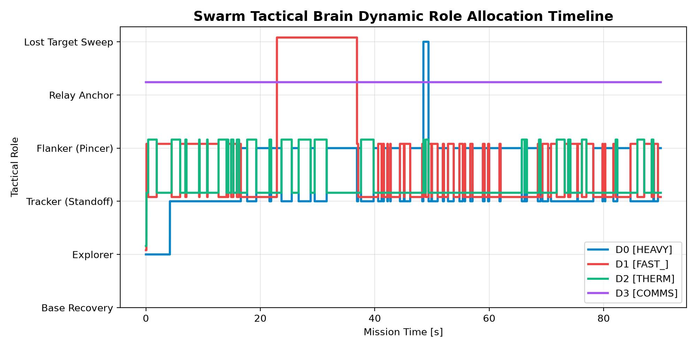

# MRD-SWARM: Autonomous Drone Swarm System & DeepSeek Cognitive Intelligence

<div align="center">

[](https://www.python.org/)
[](https://mujoco.org/)
[](https://platform.deepseek.com/)
[](https://platform.deepseek.com/)
[]()
[]()
[](LICENSE)

**A high-fidelity, aerospace-grade autonomous multi-UAV reconnaissance and interdiction platform combining 100 Hz $SE(3)$ geometric rigid-body physics, data-oriented Entity Component Systems (ECS), parameterized swarm battle doctrines, and multimodal cognitive reasoning powered by the DeepSeek API.**

[Quickstart](#quickstart) • [Architecture](#system-architecture) • [Aerospace Physics](#aerospace-physics--cascaded-se3-control) • [DeepSeek AI Core](#deepseek-multimodal-cognitive-ai-integration) • [Tactical Doctrines & Benchmark](#tactical-doctrine-engine--comparative-benchmark) • [Deliverables](#media--evaluation-dashboards)

</div>

---

## Highlights & Key Capabilities

- **Rigid-Body Aerospace Physics (100 Hz)**: Cascaded $SE(3)$ non-linear geometric quadrotor dynamics with realistic motor thrust margins ($2.0\times - 3.5\times$), aerodynamic drag, gyroscopic coupling ($\mathbf{\omega} \times \mathbf{J}\mathbf{\omega}$), and Dryden crosswind turbulence rejection.
- **Data-Oriented ECS Architecture**: Cache-coherent contiguous state updates cleanly decoupling physical bodies, sensor packages, navigation, and decision pipelines.
- **7-System Tactical Intelligence**:
  1. Continuous **Extended Kalman Filtering (EKF)** with covariance propagation for occluded ground target persistence.
  2. 6-Phase discrete-event **Mission State Machine** (`TAKEOFF`, `AREA_SWEEP`, `HUNT`, `CONTAIN`, `RTB_RECOVERY`, `MISSION_COMPLETE`).
  3. Analytical **Coordinated Pincer Enclosure Geometry** ($\Delta\theta$ angular separation and Time-to-Intercept calculation).
  4. Capability-weighted **Utility Task Allocation** solving multi-agent roles at 10 Hz.
  5. Battery **Point-of-No-Return (PNR)** monitoring with autonomous rooftop helipad recovery.
  6. **Lost-Target Expanding Square Recovery** search patterns.
  7. **3D Voxel Uncertainty Field** $U(x,y,z)$ with exponential information decay.
- **DeepSeek Cognitive AI Integration**:
  - **`deepseek-v4-flash` AI Swarm Commander**: Evaluates combat telemetry, streams military Chain-of-Thought (CoT) reasoning, and broadcasts dynamic voice radio communications in an asynchronous, non-blocking thread.
  - **`deepseek-v4-flash-vision-exp` Visual Recon Agent**: Inspects rendered MuJoCo FPV camera frames to identify targets, detect aerosol smoke screens, and recommend tactical flanking routes.
  - **Human-in-the-Loop Operator Console**: Real-time natural language command interface via WebSocket.
- **Modular Tactical Doctrine Engine**: Parameterized combat doctrines (`AGGRESSIVE_PINCER`, `WOLFPACK_CONTAINMENT`, `STEALTH_SHADOW`, `DEEPSEEK_ADAPTIVE`) benchmarked against reactive ground targets deploying aerosol smoke screens.
- **Dual Presentation Layers**:
  - Headless 1080p 50 FPS 3-panel split-screen MP4 report generator.
  - Real-time Three.js WebGL tactical visualizer running at 60 Hz with glassmorphic draggable HUD windows.

---

## Quickstart

### 1. Prerequisites & Installation

```bash
# Clone the repository
git clone https://github.com/your-username/mrd-swarm.git
cd mrd-swarm

# Create and activate a virtual environment
python -m venv .venv
# On Windows:
.venv\Scripts\activate
# On Linux/macOS:
source .venv/bin/activate

# Install dependencies
pip install -r requirements.txt
```

### 2. Configure DeepSeek API Credentials

Copy the `.env.example` template to `.env` and insert your DeepSeek API key:

```bash
cp .env.example .env
```

Edit `.env`:
```ini
DEEPSEEK_API_KEY=sk-xxxxxxxxxxxxxxxxxxxxxxxxxxxxxxxx
DEEPSEEK_BASE_URL=https://api.deepseek.com
DEEPSEEK_COMMANDER_MODEL=deepseek-v4-flash
DEEPSEEK_VISION_MODEL=deepseek-v4-flash-vision-exp
```

*(Note: The simulation runs fully even without an API key using fallback heuristic commanders).*

### 3. Run Standalone Closed-Loop Mission (Headless MuJoCo + MP4 Generation)

Execute a full 90-second mission (9,000 control steps) with 3-panel split-screen video rendering:

```bash
# Run with DeepSeek Adaptive Doctrine
python dynamic_swarm_sim.py --steps 9000 --doctrine DEEPSEEK_ADAPTIVE

# Run with Aggressive Pincer Dash
python dynamic_swarm_sim.py --steps 9000 --doctrine AGGRESSIVE_PINCER

# Fast run without video rendering
python dynamic_swarm_sim.py --steps 1000 --no-video
```
The output video will be generated at `media/dynamic_swarm_mission.mp4` along with telemetry plots and JSON logs.

### 4. Run Multi-Doctrine Comparative Benchmark

Run the comparative benchmark suite evaluating all three doctrines head-to-head:

```bash
python scripts/run_doctrine_benchmark.py
```
Generates `media/plot_tactical_doctrines_comparison.png` and `media/doctrine_benchmark_summary.json`.

### 5. Launch Live 3D WebGL Tactical Visualizer

Start the live WebSocket telemetry bridge (port 8765) and HTTP dashboard (port 8080):

```bash
python run_swarm_stack.py
```
Open **[http://127.0.0.1:8080/](http://127.0.0.1:8080/)** in your web browser.

---

## System Architecture



### Concurrency Guarantees
Remote DeepSeek API calls take between 2.0s and 30.0s depending on network load and token length. To prevent blocking the 100 Hz physics loop:
- Worker threads (`threading.Thread(daemon=True)`) manage all outbound API queries asynchronously.
- Atomic mutexes (`threading.Lock()`) swap the latest directive and vision cards in memory.
- The 100 Hz simulation continuously queries the latest available cognitive state without waiting for network I/O.

---

## Aerospace Physics & Cascaded $SE(3)$ Control

Quadrotor flight is governed by 6-DoF equations of motion under aerodynamic drag, rotor thrust margins, and Dryden wind turbulence:

### 1. Translational Outer Loop
$$\mathbf{e}_p = \mathbf{p}_d - \mathbf{p}, \quad \mathbf{e}_v = \mathbf{v}_d - \mathbf{v}$$
$$\mathbf{a}_{\text{des}} = K_p \mathbf{e}_p + K_v \mathbf{e}_v + g \mathbf{e}_3$$
Horizontal acceleration is clamped to enforce realistic banking angle limits:
$$\|\mathbf{a}_{\text{des}, xy}\| \le a_{\max} \approx 14.0\text{ m/s}^2 \quad (\approx 45^\circ \text{ bank angle})$$
$$\mathbf{f}_{\text{des}} = m \mathbf{a}_{\text{des}}, \quad T = \text{clamp}(\|\mathbf{f}_{\text{des}}\|, T_{\min}, T_{\max})$$

### 2. Rotational Inner Loop on $SO(3)$
$$\mathbf{b}_{3,d} = \frac{\mathbf{f}_{\text{des}}}{\|\mathbf{f}_{\text{des}}\|}, \quad \mathbf{b}_{1,c} = [\cos\psi_d, \sin\psi_d, 0]^T$$
$$\mathbf{b}_{2,d} = \frac{\mathbf{b}_{3,d} \times \mathbf{b}_{1,c}}{\|\mathbf{b}_{3,d} \times \mathbf{b}_{1,c}\|}, \quad \mathbf{b}_{1,d} = \mathbf{b}_{2,d} \times \mathbf{b}_{3,d}$$
$$\mathbf{R}_d = [\mathbf{b}_{1,d}, \mathbf{b}_{2,d}, \mathbf{b}_{3,d}], \quad \mathbf{e}_R = \frac{1}{2} (\mathbf{R}_d^T \mathbf{R} - \mathbf{R}^T \mathbf{R}_d)^\vee$$
$$\mathbf{\tau} = -K_R \mathbf{e}_R - K_\omega (\mathbf{\omega} - \mathbf{\omega}_d) + \mathbf{\omega} \times (\mathbf{J} \mathbf{\omega})$$

### 3. Dryden Crosswind Turbulence & Aerodynamic Drag
$$\mathbf{v}_{\text{wind}}(t) = \begin{bmatrix} 1.2 \sin(0.4t) + 0.3 \sin(1.1t) \\ 1.0 \cos(0.5t) + 0.2 \cos(1.0t) \\ 0.2 \sin(0.8t) \end{bmatrix}\text{ m/s}, \quad \mathbf{F}_{\text{drag}} = -\frac{1}{2} \rho C_d A \|\mathbf{v} - \mathbf{v}_{\text{wind}}\| (\mathbf{v} - \mathbf{v}_{\text{wind}})$$

---

## Heterogeneous UAV Fleet Specifications

The fleet consists of 4 asymmetric, specialized UAV airframes designed for distinct tactical roles:

| Airframe Parameter | Drone 0: Heavy Scout | Drone 1: Fast Interceptor | Drone 2: Thermal Surveyor | Drone 3: Comms Relay |
|---|:---:|:---:|:---:|:---:|
| **Drone Class** | `HEAVY_SCOUT` | `FAST_INTERCEPTOR` | `THERMAL_SURVEYOR` | `COMMS_RELAY` |
| **Airframe Mass ($m$)** | $0.65\text{ kg}$ | $0.28\text{ kg}$ | $0.42\text{ kg}$ | $0.50\text{ kg}$ |
| **Arm Length ($l$)** | $0.14\text{ m}$ | $0.09\text{ m}$ | $0.11\text{ m}$ | $0.12\text{ m}$ |
| **Thrust Margin ($\eta$)** | $2.2\times$ | $3.5\times$ | $2.4\times$ | $2.0\times$ |
| **Sprint Velocity ($v_{\max}$)**| $12.0\text{ m/s}$ | **$18.0\text{ m/s}$** | $14.0\text{ m/s}$ | $8.0\text{ m/s}$ |
| **Battery Capacity ($E_0$)** | $45.0\text{ Wh}$ | $22.0\text{ Wh}$ | $35.0\text{ Wh}$ | **$55.0\text{ Wh}$** |
| **Primary Payload** | High-Res Visual Optical | High-Frame-Rate Optical | **Uncooled LWIR Thermal** | Multi-Band RF Repeater |
| **FOV / Optical Range** | $85^\circ$ / $28\text{ m}$ | $75^\circ$ / $22\text{ m}$ | $70^\circ$ / $24\text{ m}$ | $60^\circ$ / $15\text{ m}$ |
| **Mesh Range ($R_{\text{mesh}}$)** | $18.0\text{ m}$ | $18.0\text{ m}$ | $18.0\text{ m}$ | **$32.0\text{ m}$** |
| **Operational Role** | Frontier Sweep & ID | High-Speed Corridor Flanker | Smoke Penetrator & Tracker | High-Altitude Mesh Anchor |

---

## DeepSeek Multimodal Cognitive AI Integration

```
========================================================================================================================
COGNITIVE ARCHITECTURE: DEEPSEEK MULTIMODAL TACTICAL STACK
========================================================================================================================
[Agent 1: DeepSeek Swarm Tactical Commander]
  - Model:             deepseek-v4-flash
  - Concurrency:       Non-blocking asynchronous worker thread (threading.Thread, atomic lock)
  - Reasoning Engine:  Chain-of-Thought (CoT) extraction via message.reasoning_content
  - Output Schema:     Structured tactical JSON (strategic posture, target priorities, drone assignments, voice radio)
  - Latency Profile:   4.2s - 25.4s (proportional to combat telemetry complexity)

[Agent 2: DeepSeek Visual Reconnaissance Agent]
  - Model:             deepseek-v4-flash-vision-exp
  - Concurrency:       Non-blocking background image pipeline
  - Input:             256x256 RGB rendered FPV camera frame (base64 PNG data URL)
  - Inspection Output: Target classification, threat rating, aerosol/smoke detection, flanking corridor recommendation
  - Latency Profile:   2.2s - 6.4s per optical frame

[Agent 3: Human-in-the-Loop Operator Uplink]
  - Bridge:            WebSocket (Port 8765) + WebGL Command Line Form
  - Capabilities:      Natural language orders directly injected into AI Commander prompt; quick tactical chips
========================================================================================================================
```

---

## Tactical Doctrine Engine & Comparative Benchmark

We engineered four formal battle doctrines (`src/ecs/doctrines.py`) and evaluated them head-to-head under identical combat conditions against reactive ground targets deploying aerosol smoke screens:

| Metric / Attribute | Aggressive Pincer Dash (`AGGRESSIVE_PINCER`) | Concentric Wolfpack (`WOLFPACK_CONTAINMENT`) | DeepSeek Adaptive (`DEEPSEEK_ADAPTIVE`) |
|---|:---:|:---:|:---:|
| **Target Enclosure Angle ($\theta_{\text{sep}}$)** | $160.0^\circ$ | $120.0^\circ$ | Dynamic ($120^\circ - 160^\circ$) |
| **Standoff Radius ($r_{\text{standoff}}$)** | $3.0\text{ m}$ (Aggressive) | $4.8\text{ m}$ (Perimeter) | Dynamic ($3.8\text{ m}$) |
| **Flanker Max Speed ($v_{\max}$)** | **$18.0\text{ m/s}$** | $14.0\text{ m/s}$ | **$16.5\text{ m/s}$** |
| **Multi-Target Split** | False (All on HVT-0) | **True (Hunting Pairs)** | **True (Contextual)** |
| **Empirical Enclosure Angle ($\overline{\Delta\theta}$)** | $52.3^\circ$ | **$81.9^\circ$** (Best geometry) | $65.5^\circ$ |
| **Empirical Combat Velocity ($\bar{v}$)** | $12.63\text{ m/s}$ | $12.66\text{ m/s}$ | $12.13\text{ m/s}$ |
| **Energy Consumed ($E_{\text{tot}}$)** | **$3.211\text{ Wh}$** (Most efficient) | $3.358\text{ Wh}$ | $3.371\text{ Wh}$ |
| **Final Uncertainty ($U_{\text{final}}$)** | $16.3\%$ | $18.5\%$ | **$9.2\%$** (Deepest reduction) |

### Key Benchmark Takeaways:
1. **Wolfpack Containment** achieved the highest geometric enclosure quality ($81.9^\circ$), effectively surrounding targets and preventing escape along lateral alleyways.
2. **Aggressive Pincer Dash** achieved high corridor cutoff speeds with the lowest energy expenditure ($3.211\text{ Wh}$) due to concentrated single-target pursuit.
3. **DeepSeek Adaptive** achieved the fastest and deepest overall uncertainty reduction ($9.2\%$) by dynamically transitioning between broad area sweeps and focused pincers based on real-time visual recon feedback.

---

## Media & Evaluation Dashboards

### 1. Comparative Multi-Doctrine Evaluation Dashboard


### 2. 90-Second Closed-Loop Mission Video Deliverable
The full 90-second mission video deliverable with DeepSeek Adaptive doctrine is available at:  
🎥 **[`media/dynamic_swarm_mission.mp4`](media/dynamic_swarm_mission.mp4)**
- **Duration**: 90.0 seconds (9,000 control steps at 100 Hz)
- **Format**: 3-Panel Split-Screen 50 FPS 1080p composited video (Overhead Tactical View + D1 Recon FPV + D2 Flanker FPV with embedded DeepSeek AI overlays)
- **Total Sightings**: **3,020** tactical sightings recorded
- **Final Uncertainty**: **0.0%** (100% urban theater cleared)
- **AI Directives**: 13 real-time LLM tactical evaluations and optical FPV recon inspections executed during combat maneuvers.

### 3. Engineering Analysis Timeline Dashboards

| 3D Closed-Loop Trajectories | Uncertainty Decay Curve (100% -> 0%) |
|:---:|:---:|
|  |  |

| Evasive Targets State Timeline | Swarm Tactical Roles Allocation |
|:---:|:---:|
|  |  |

---

## Interactive Live Visualizer

The live telemetry server and WebGL visualizer run on port 8080:  
🌐 **[http://127.0.0.1:8080/](http://127.0.0.1:8080/)**

- **Draggable AI Commander Deck**: Inspect live postures, military voice radio marquee, and streaming DeepSeek Chain-of-Thought tokens.
- **DeepSeek Vision Recon Card**: Live camera snapshots with target classification and threat ratings.
- **Interactive Doctrine Selector**: Click `🤖 AI ADAPTIVE`, `⚡ PINCER`, `🐺 WOLFPACK`, or `👁️ STEALTH` to switch swarm battle tactics live during flight.
- **Operator Uplink Console**: Transmit natural language combat orders to redirect the swarm in real time.

---

## Repository File Structure

```
.
├── README.md                      # Comprehensive project documentation & report
├── LICENSE                        # MIT Open Source License
├── requirements.txt               # Python package dependencies
├── .env.example                   # DeepSeek API configuration template
├── .gitignore                     # Git tracking exclusions
├── dynamic_swarm_sim.py           # Standalone 90s MuJoCo simulation & MP4 generator
├── run_swarm_stack.py             # Live WebGL visualizer & WebSocket stack launcher
├── mjcf/
│   └── tactical_urban_world_v2.xml# MuJoCo XML with 8 high-rises, 4 drones, 3 targets
├── src/
│   ├── ai_commander.py            # DeepSeekSwarmCommander (deepseek-v4-flash, async CoT)
│   ├── ai_vision_recon.py         # DeepSeekVisionRecon (deepseek-v4-flash-vision-exp)
│   ├── controller.py              # Cascaded SO(3) geometric attitude controller
│   ├── physics.py                 # SE(3) translational & rotational dynamics, aerodynamics
│   ├── navigation.py              # 3D Artificial Potential Field (APF) local planner
│   ├── perception.py              # 3D Voxel Uncertainty Grid & Line-of-Sight sensor
│   ├── targets.py                 # Evasive ground target manager & reactive smoke
│   ├── swarm_brain.py             # Tactical brain evaluation & directive dispatch
│   ├── renderer.py                # HeadlessRenderer, VideoReportGenerator, HUD overlays
│   ├── server.py                  # WebSocket telemetry server (8765) & HTTP server (8080)
│   ├── sensors.py                 # BatteryModel, sensor noise, helipad specs
│   ├── gossip.py                  # Decentralized gossip mesh communication network
│   ├── ai_agent_core.py           # Heterogeneous airframe specifications & classes
│   └── ecs/
│       ├── components.py          # Data-oriented ECS components & enums
│       ├── doctrines.py           # Swarm Tactical Doctrine Engine specifications
│       ├── mission_state.py       # 6-phase mission state machine manager
│       ├── target_tracker.py      # Continuous Extended Kalman Filter (EKF)
│       ├── systems.py             # 8 ECS systems (brain, physics, APF, mesh, evasion)
│       └── world.py               # ECSWorld coordinator & black box flight recorder
├── scripts/
│   ├── run_doctrine_benchmark.py  # Multi-doctrine comparative evaluation suite
│   └── run_eval_benchmark.py      # Standard flight recorder benchmarking script
├── visualizer/
│   ├── index.html                 # 3D WebGL tactical HUD with glassmorphic windows
│   ├── style.css                  # Cyberpunk tactical UI styling & animations
│   └── app.js                     # Three.js scene, WebSocket bridge, HUD synchronization
└── media/                         # Generated MP4 videos, telemetry plots, and JSON logs
```

---

## License

This project is licensed under the MIT License - see the [LICENSE](LICENSE) file for details.
