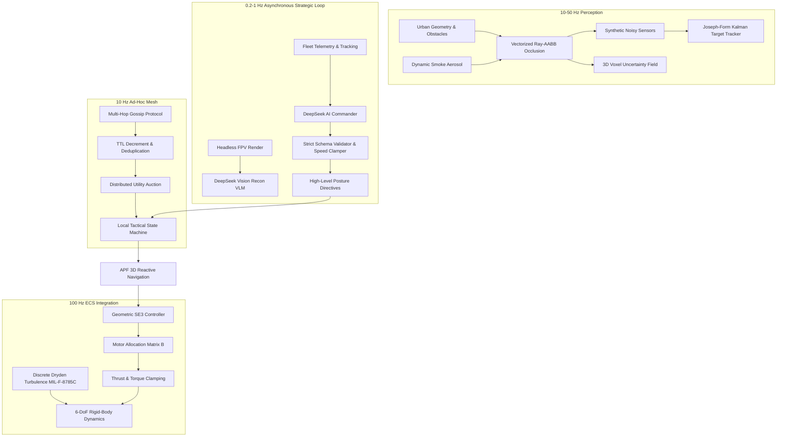

# MRD-SWARM: System Architecture & Technical Specification

## 1. Architectural Overview

MRD-SWARM (Multi-Agent Reactive Drone Swarm) is a modular simulation and experimental framework designed for evaluating distributed multi-agent tactics, sensor-guided target interception, and autonomous tactical decision-making in complex 3D urban environments.

The system is decoupled into:
1. **Simulation & Physics Core**: 100 Hz discrete-time 6-DoF rigid-body quadrotor flight dynamics, Dryden atmospheric turbulence filters (MIL-F-8785C), and motor allocation mixer matrix.
2. **Perception & State Estimation**: Synthetic noisy sensor pipelines (FOV, range, Ray-AABB building occlusion, optical aerosol attenuation), 3D voxel uncertainty grid, and Joseph-stabilized linear Kalman target tracking.
3. **Decentralized Multi-Hop Mesh Network**: Ad-hoc gossip communication protocol with TTL decrementing, duplicate packet suppression, and distributed utility auctions.
4. **Cognitive AI Commander & Vision Reconnaissance**: Asynchronous LLM/VLM tactical oversight (DeepSeek-v4) strictly isolated within a formal **AI Authority Model** that guarantees physical safety invariants.
5. **Rendering & Visualization**: MuJoCo 3.x offscreen headless rendering pipeline and real-time 60 Hz WebSocket telemetry streaming to a Three.js 3D tactical HUD.

---

## 2. Authoritative Vehicle Configurations

All airframe parameters are strictly governed by `src/config/airframes.py`. The simulation enforces four heterogeneous drone airframes:

| Parameter | Unit | Drone 0 (Heavy Scout) | Drone 1 (Fast Interceptor) | Drone 2 (Thermal Surveyor) | Drone 3 (Comms Relay) |
|---|---|:---:|:---:|:---:|:---:|
| **Role Designation** | - | Primary Urban Scout | High-Speed Interceptor | Smoke / Thermal Specialist | High-Altitude Network Relay |
| **Airframe Mass ($m$)** | $\text{kg}$ | 0.650 | 0.280 | 0.420 | 0.500 |
| **Arm Length ($L$)** | $\text{m}$ | 0.140 | 0.085 | 0.110 | 0.125 |
| **Thrust Margin** | - | 2.40 | 3.80 | 2.60 | 2.20 |
| **Max Thrust per Motor** | $\text{N}$ | 3.82 | 2.61 | 2.68 | 2.70 |
| **Max Total Thrust** | $\text{N}$ | 15.30 | 10.44 | 10.72 | 10.79 |
| **Inertia $I_{xx}, I_{yy}$** | $\text{kg}\cdot\text{m}^2$ | $1.8 \times 10^{-3}$ | $0.6 \times 10^{-3}$ | $1.1 \times 10^{-3}$ | $1.4 \times 10^{-3}$ |
| **Inertia $I_{zz}$** | $\text{kg}\cdot\text{m}^2$ | $3.2 \times 10^{-3}$ | $1.1 \times 10^{-3}$ | $2.0 \times 10^{-3}$ | $2.6 \times 10^{-3}$ |
| **Max Linear Speed** | $\text{m/s}$ | 12.0 | 18.0 | 14.0 | 8.0 |
| **Battery Capacity** | $\text{Wh}$ | 35.0 | 18.0 | 28.0 | 42.0 |
| **RF Transmit Range** | $\text{m}$ | 18.0 | 18.0 | 18.0 | 32.0 |
| **Cruise Altitude** | $\text{m}$ | 3.5 | 4.0 | 3.0 | 10.5 |
| **Sensor Payload** | - | Wide RGB Camera | Tracking Optical Gimbal | Long-Wave Infrared (LWIR) | Omnidirectional Mesh Relay |

---

## 3. Flight Controller & Actuator Allocation

### 3.1 Geometric $SE(3)$ Attitude Control
The flight control pipeline implements geometric tracking on the Special Euclidean group $SE(3)$:

$$\mathbf{e}_p = \mathbf{p} - \mathbf{p}_d, \quad \mathbf{e}_v = \mathbf{v} - \mathbf{v}_d$$

$$\mathbf{F}_{des} = -k_p \mathbf{e}_p - k_v \mathbf{e}_v + m g \mathbf{e}_3 + m \mathbf{a}_d$$

$$\mathbf{b}_{3,d} = \frac{\mathbf{F}_{des}}{\|\mathbf{F}_{des}\|}, \quad \mathbf{b}_{2,d} = \frac{\mathbf{b}_{3,d} \times \mathbf{b}_{1,d}^{yaw}}{\|\mathbf{b}_{3,d} \times \mathbf{b}_{1,d}^{yaw}\|}, \quad \mathbf{b}_{1,d} = \mathbf{b}_{2,d} \times \mathbf{b}_{3,d}$$

The rotation matrix error $\mathbf{e}_R$ on $SO(3)$ is computed via the skew-symmetric un-vee operator:

$$\mathbf{e}_R = \frac{1}{2} \left( \mathbf{R}_d^T \mathbf{R} - \mathbf{R}^T \mathbf{R}_d \right)^\vee$$

$$\boldsymbol{\tau} = -k_R \mathbf{e}_R - k_\omega \mathbf{e}_\omega + \boldsymbol{\omega} \times (\mathbf{J} \boldsymbol{\omega})$$

### 3.2 4-Rotor Mixer Allocation Matrix
Commanded total thrust $T$ and body moments $\boldsymbol{\tau} = [\tau_x, \tau_y, \tau_z]^T$ are resolved into individual motor thrusts $[T_1, T_2, T_3, T_4]^T$ via the quadrotor cross-configuration mixer:

$$\begin{bmatrix} T \\ \tau_x \\ \tau_y \\ \tau_z \end{bmatrix} = \mathbf{B} \begin{bmatrix} T_1 \\ T_2 \\ T_3 \\ T_4 \end{bmatrix} = \begin{bmatrix} 1 & 1 & 1 & 1 \\ \frac{L}{\sqrt{2}} & -\frac{L}{\sqrt{2}} & -\frac{L}{\sqrt{2}} & \frac{L}{\sqrt{2}} \\ \frac{L}{\sqrt{2}} & \frac{L}{\sqrt{2}} & -\frac{L}{\sqrt{2}} & -\frac{L}{\sqrt{2}} \\ c & -c & c & -c \end{bmatrix} \begin{bmatrix} T_1 \\ T_2 \\ T_3 \\ T_4 \end{bmatrix}$$

where $c = \frac{k_m}{k_f}$. Motor thrusts are clamped to $[0, T_{max}]$, and actuator saturation events are registered and tracked in telemetry.

---

## 4. Perception & Estimation Pipeline

### 4.1 Synthetic Sensor Modeling
The simulation avoids feeding unadulterated simulation state into vehicle logic. Sensors are evaluated via `SyntheticTargetSensor`:
- **Range & Field-of-View**: Targets outside range $R_{max}$ or angle $\theta > \frac{\Phi_{FOV}}{2}$ are invisible.
- **Occlusion**: Vectorized ray-AABB intersection tests against all urban building geometries determine line-of-sight blockage.
- **Atmospheric / Smoke Attenuation**: Visual optical sensors (D0, D1, D3) undergo complete detection dropout inside smoke aerosols. Thermal surveyor (D2) penetrates smoke unimpeded.
- **Measurement Noise**: Additive range-bearing Gaussian noise:
  $$r_{meas} = r_{true} + \mathcal{N}(0, \sigma_r^2), \quad \theta_{meas} = \theta_{true} + \mathcal{N}(0, \sigma_\theta^2)$$
- **Stochastic Dropout**: Independent Bernouilli packet loss ($p_{drop} = 0.05$).

### 4.2 Joseph-Stabilized Linear Kalman Target Tracking
Targets are tracked using discrete-time constant-velocity kinematic models:

$$\mathbf{x}_{k} = \mathbf{F} \mathbf{x}_{k-1} + \mathbf{w}_k, \quad \mathbf{z}_k = \mathbf{H} \mathbf{x}_k + \mathbf{v}_k$$

To prevent numerical covariance collapse or loss of positive-definiteness during floating-point operations, covariance updates strictly use the **Joseph stabilized form**:

$$\mathbf{P}_{k|k} = (\mathbf{I} - \mathbf{K}_k \mathbf{H}) \mathbf{P}_{k|k-1} (\mathbf{I} - \mathbf{K}_k \mathbf{H})^T + \mathbf{K}_k \mathbf{R}_k \mathbf{K}_k^T$$

Tracks transition through an explicit lifecycle state machine:
$$\text{UNINITIALIZED} \xrightarrow{z_k} \text{CONFIRMED} \xrightarrow{\Delta t > 2.0s} \text{PREDICTED} \xrightarrow{\Delta t > 8.0s} \text{LOST}$$

---

## 5. Mesh Networking & Distributed Task Allocation

- **Topology**: Ad-hoc wireless mesh network constrained by Euclidean communication range ($18.0\text{m}$ for scouts, $32.0\text{m}$ for relay).
- **Multi-Hop Routing**: Packets carry an origin ID, sequence number, and Time-To-Live counter (`ttl = 3`). Intermediate nodes decrement TTL and re-broadcast packets to neighbors outside direct sender range.
- **Deduplication**: 60-second sliding cache prevents infinite broadcast loops.
- **Task Allocation**: Distributed utility auction resolves target tracking assignments. Drones compute bids based on distance, battery state, and airframe suitability, resolving conflicts without a centralized server.

---

## 6. AI Authority Model & Safety Boundaries

The AI layer (`DeepSeekSwarmCommander` & `DeepSeekVisionRecon`) operates strictly as an asynchronous strategic advisory channel:
1. **Advisory Posture Directives Only**: The LLM specifies strategic doctrine (`AGGRESSIVE_PINCER`, `CONCENTRIC_CONTAINMENT`, `STEALTH_SHADOW`) and target priorities.
2. **Speed & Acceleration Clamping**: All requested speeds are clamped to $[1.0, v_{max,i}]$ by deterministic pre-execution code.
3. **No Direct Actuator or Motor Access**: The LLM cannot command raw motor thrusts, attitude angles, or bypass collision avoidance.
4. **Collision Avoidance Primacy**: Local Artificial Potential Field (APF) navigators have ultimate pre-emptive control over waypoints to prevent obstacle impacts.
5. **Deterministic Fallback**: If network latency exceeds 2.5s, HTTP connections fail, or JSON schema validation detects malformed responses, the system falls back instantaneously to deterministic onboard heuristics with zero simulation pauses.
